# AIML.RAGOpsLab (LangChain) — Work in Progress

A clean, incremental build of a local RAG system using LangChain + Ollama + Chroma.

## What this repo is

- A LangChain-first RAG lab that grows in small, demoable increments.
- A local-first stack that uses Ollama for models and Chroma for storage.
- A CLI-driven workflow for ingesting data and chatting with it.

## Repo layout

```
AIML.RAGOpsLab
├─ ragopslab/          # Python package + CLI
├─ config.yaml         # Default configuration (auto-loaded)
├─ data/               # Sample data (optional)
├─ storage/            # Local vector store persistence
├─ requirements.txt    # Dependencies (managed via uv)
├─ README.md           # Repo overview (this file)
```

## Requirements

- Python 3.10+
- uv
- Ollama running locally

## Architecture

- **Ingest**: file loaders (txt/md/pdf) → chunking → embeddings (Ollama) → Chroma
- **Chat**: retrieve top‑k chunks from Chroma → answer with Ollama + citations
- **Inspect**: list stored chunks and metadata in table/CSV/TSV formats
- **Config**: `config.yaml` provides defaults; CLI flags override per run



## Yet to come (Work in Progress)

- **LangGraph orchestration** — adaptive retrieval and retries.
- **More data formats + metadata** — CSV/JSON/SQL loaders and targeted filters.
- **Advanced LangChain tooling** — evals, tracing, optional serving.

## Setup

```bash
cd AIML.RAGOpsLab
uv venv
source .venv/bin/activate
uv pip install -r requirements.txt

# Ensure Ollama is running and models are available
ollama pull nomic-embed-text
ollama pull llama3.1:8b
```

## Quickstart

```bash
# Ingest documents (reset for a clean index)
python -m ragopslab ingest --reset

# Ask a question
python -m ragopslab chat --query "Summarize the resume in 3 bullet points."
```

## Configuration

- `config.yaml` is auto-loaded by default.
- CLI flags override values from `config.yaml`.

Default `config.yaml`:
```yaml
paths:
  data_dir: data/sample_docs
  persist_dir: storage/chroma

chroma:
  collection: ragopslab

models:
  embedding_model: nomic-embed-text
  chat_model: llama3.1:8b

chunking:
  chunk_size: 1000
  chunk_overlap: 200

files:
  extensions: [txt, md, pdf]

list:
  limit: 5
  format: table
  preview_width: 80

retrieval:
  k: 4
```

Default config sections:
- `paths`: `data_dir`, `persist_dir`
- `chroma`: `collection`
- `models`: `embedding_model`, `chat_model`
- `chunking`: `chunk_size`, `chunk_overlap`
- `files`: `extensions`
- `list`: `limit`, `format`, `preview_width`
- `retrieval`: `k`

## CLI commands

### `ingest`

Index files into Chroma.

```bash
python -m ragopslab ingest --reset
```

Options:
- `--config`: path to config file (default: `config.yaml`)
- `--data-dir`: directory to ingest (default from config)
- `--persist-dir`: Chroma storage directory (default from config)
- `--collection`: Chroma collection name (default from config)
- `--embedding-model`: Ollama embedding model (default from config)
- `--chunk-size`: chunk size (default from config)
- `--chunk-overlap`: chunk overlap (default from config)
- `--extensions`: comma-separated list (or config list)
- `--reset`: delete existing Chroma data before re-indexing

Behavior:
- Duplicate files (by `source` path) are skipped and reported as `Duplicate: <path>`.

Examples:
```bash
# Ingest a specific directory
python -m ragopslab ingest \
  --data-dir data/sample_docs \
  --persist-dir storage/chroma \
  --collection ragopslab \
  --embedding-model nomic-embed-text

# Full re-index
python -m ragopslab ingest --reset
```

### `list`

Inspect stored chunks and metadata.

```bash
python -m ragopslab list --limit 5
```

Options:
- `--config`: path to config file (default: `config.yaml`)
- `--persist-dir`: Chroma storage directory (default from config)
- `--collection`: Chroma collection name (default from config)
- `--limit`: number of rows (use `0` for all rows)
- `--format`: `table|csv|tsv` (default from config)
- `--preview-width`: preview width (default from config)
- `--full-meta`: include full metadata column
- `--page`: filter to a PDF page number
- `--chunk-text`: show full chunk text (not preview)
- `--include-vectors`: include embedding vectors
- `--vector-dims`: limit vector dimensions in output
- `--output`: write CSV/TSV to a file (relative paths allowed)

Notes:
- For large output (full chunks or vectors), use CSV/TSV + `--output`.
- `--output` is only supported for CSV/TSV.

Examples:
```bash
# CSV output
python -m ragopslab list --format csv --limit 5

# All rows to CSV file
python -m ragopslab list --limit 0 --format csv --output temp/chroma_list.csv

# Filter to a page and include vectors (large output)
python -m ragopslab list \
  --page 0 \
  --chunk-text \
  --include-vectors \
  --vector-dims 10 \
  --format csv \
  --output temp/page0_chunks_vectors_10dims.csv
```

Sample output (captured):
```bash
python -m ragopslab list --limit 3 --format csv
#,id,file,page,ext,preview
1,837d56f0-6e58-40db-b489-4fd0407d044e,Marcelino Jackson - Senior DevSecOps-GenAI-LLMOps Architect.pdf,0,pdf,Marcelino Jackson Senior DevSecOps Architect & GenAI/LLMOps Engineer 📧…
2,038252db-798b-4263-86b2-3408181905cf,Marcelino Jackson - Senior DevSecOps-GenAI-LLMOps Architect.pdf,0,pdf,US Citizen with Secret ‘Q’ Dept-of-Energy(DOE) Clearance Work Accomplishment…
3,d2da6332-8a7d-44ae-932c-e1b1c4bbac46,Marcelino Jackson - Senior DevSecOps-GenAI-LLMOps Architect.pdf,0,pdf,·Enforced strict RBAC and dynamic AISQL governance within an existing SnowVlake…
```

### `chat`

Ask questions against indexed data (basic RAG loop).

```bash
python -m ragopslab chat --query "Summarize the resume in 3 bullet points."
```

Options:
- `--config`: path to config file (default: `config.yaml`)
- `--query`: question to ask (required)
- `--persist-dir`: Chroma storage directory (default from config)
- `--collection`: Chroma collection name (default from config)
- `--embedding-model`: embedding model for retrieval (default from config)
- `--chat-model`: Ollama chat model (default from config)
- `--k`: number of chunks retrieved (default from config)
- `--output-format`: `markdown|json|plain` (default: `markdown`)

Output:
- Answer + citations (file, page, source)

Examples:
```bash
# Default markdown output
python -m ragopslab chat --query "Summarize the resume in 3 bullet points."

# JSON output for scripting
python -m ragopslab chat --query "Summarize the resume in 3 bullet points." --output-format json
```

## Chroma data behavior

- Re-running `ingest` now **skips duplicates** when a file has already been indexed.
- Duplicate files are reported as `Duplicate: <path>` and are not re-loaded.
- To start fresh, use `--reset` to delete the Chroma persistence directory before indexing.

## PDF ingestion notes

- PDF parsing warnings from `pypdf` are suppressed to keep ingest output clean.

## Inspecting Chroma data

- Use `python -m ragopslab list --limit 0` to return **all rows** in the collection.
- Use `--format csv|tsv` for scrollable output, and `--output <file>` to save to disk.
- Use `--page <n>` to filter by PDF page, `--chunk-text` for full chunk text, and `--include-vectors` (optionally `--vector-dims N`) to export embeddings.
